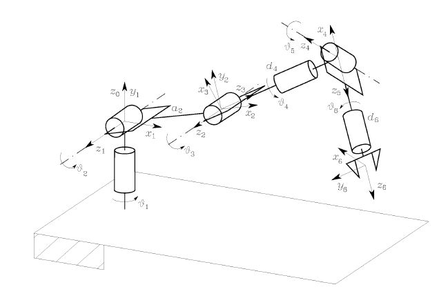

# robot_arm_with_vision
This is my code for a 6 DoF robot arm with robot vision provided by the opencv library. 
If you have any questions you can email me: thomas-hiemstra@hotmail.com
Also check out my youtube channel to see it in action:
https://www.youtube.com/playlist?list=PLbkbtgo3fITXZn4Wy8z1Y2U5hJxXYStNk

