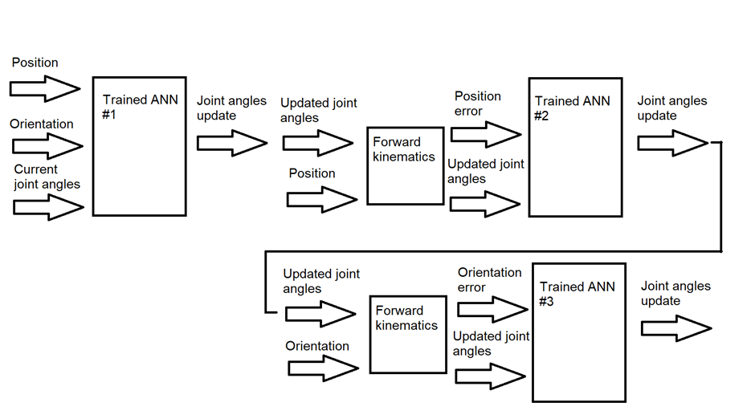

# Robot arm with vision
A 3d printed 6 DoF robotic arm which uses computer vision provided by the openCV library.

## Capabilities

Detecting and picking up objects:

Detecting and avoiding obstacles:

Real time object tracking:

Videos of the robot in action can be found at:

https://www.youtube.com/playlist?list=PLbkbtgo3fITXZn4Wy8z1Y2U5hJxXYStNk

## Inverse kinematics

Schemetically this arm is an anthropomorphic arm with a spherical wrist:

This means the inverse kinematics can be solved analytically by method called kinematic decoupling.

It is also possible however to solve the inverse kinematics problem in general using neural networks.
Since the forward kinematics of the arm is always known thanks to the DH parameters it is always
possible to consturct a data set of angles and corresponding poses of the arm. The network can then
be trained on this data set to learn the inverse relation.

During testing I found that a single network is not accurate enough to produce usefull  results (i.e. small enough errors).
Using multiple networks however solved this problem by letting each network improve the result of the previous one.

The first network takes the desired pose of the arm and produces a prediction for all the angels, the consecutive networks
take the calculated angles and the error between the desired pose and the pose produced by the predicted angles.

This chain of neural networks ultimately leads to an error of less than 1% per angle which is good enough to perform various tasks.

